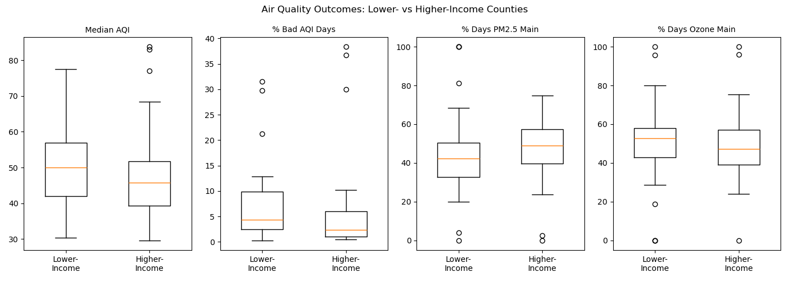
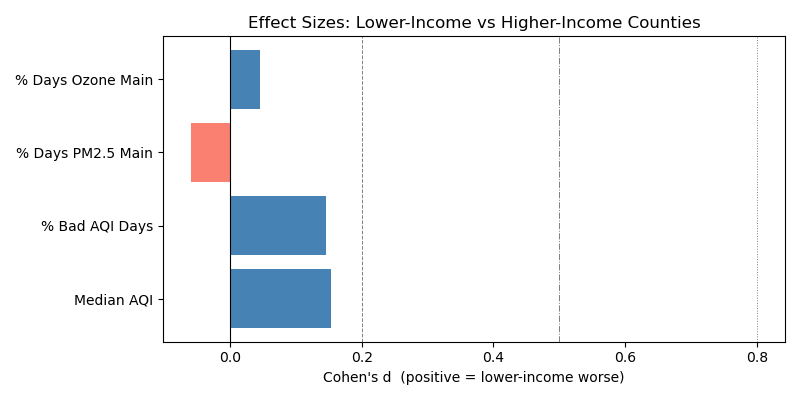

# Hypothesis Testing

We tested whether lower-income California counties experience statistically worse air quality than higher-income counties. Counties were split using the lower_income_group flag in the dataset, placing the bottom two income quartiles in the lower-income group (25 counties) and the top two in the higher-income group (28 counties).

For each outcome we ran a one-sided Welch t-test with the null hypothesis that the means are equal and the alternative that lower-income counties are worse. We confirmed each result with a Mann-Whitney U test. The significance level was α = 0.05.

## Outcomes Tested

We tested four air quality outcomes: Median AQI, percentage of bad AQI days, percentage of days where PM2.5 was the main pollutant, and percentage of days where ozone was the main pollutant.

## Results

None of the four outcomes produced a statistically significant difference at α = 0.05. For Median AQI, the lower-income group averaged 50.5 versus 48.5 for higher-income counties, but the Welch t-test returned p = 0.29 and a Cohen's d of 0.15, indicating a negligible effect. For percentage of bad AQI days, the means were 7.8 versus 6.5, with p = 0.30 and d = 0.15. For percentage of days where PM2.5 was the main pollutant, lower-income counties actually averaged slightly lower (45.9 vs 47.3), producing a negative d of -0.06. For ozone, the difference was similarly negligible (50.3 vs 49.2, p = 0.44).

The Mann-Whitney U test on percentage of bad AQI days returned p = 0.037, which crosses the threshold in isolation, but does not hold up alongside the other three non-significant results.

## Interpretation

At the county level, income group alone does not clearly separate worse air quality from better. Cohen's d values are all below 0.2, meaning even the directional differences are small in practical terms. This likely reflects the coarseness of county-level aggregation — some of California's highest-income counties sit geographically close to the heavily polluted Central Valley, which compresses any income-based signal when averaged at the county scale.

## Figures

Figure 1: Box plots of each air quality outcome by income group

Figure 2: Cohen's d effect sizes across outcomes

