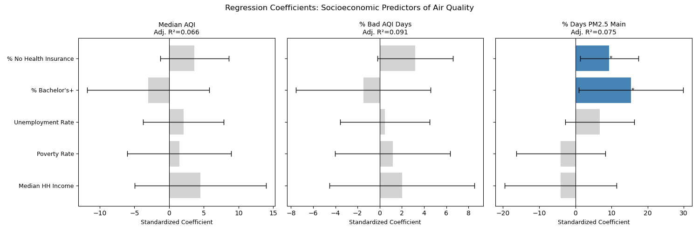
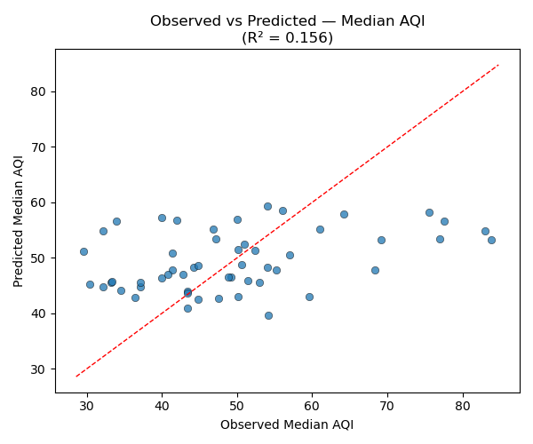

# Linear Regression

We fit multiple linear regression models to estimate how well socioeconomic variables predict air quality outcomes across 53 California counties. The five predictors were median household income, poverty rate, unemployment rate, percentage with a bachelor's degree or higher, and percentage with no health insurance. All predictors were standardized before fitting so their coefficients are directly comparable in magnitude. Three separate OLS models were fit, one each for Median AQI, percentage of bad AQI days, and percentage of days where PM2.5 was the main pollutant.

## Results

For Median AQI, the model produced an R² of 0.156 and an adjusted R² of 0.069. The F-statistic was 1.74 with p = 0.144, meaning the predictors as a set did not significantly explain variation in median AQI. No individual predictor reached significance, though percentage with no health insurance had the largest positive coefficient (3.64).

For percentage of bad AQI days, the model explained slightly more variance with R² = 0.178 and adjusted R² = 0.094. The F-test returned p = 0.090, again non-significant. Percentage with no health insurance had the largest coefficient (3.21, p = 0.065), narrowly missing significance.

For percentage of days where PM2.5 was the main pollutant, R² was 0.164 with adjusted R² of 0.076 and F-test p = 0.123. Two predictors reached significance at α = 0.05: percentage with a bachelor's degree or higher (β = 15.40, p = 0.037) and percentage with no health insurance (β = 9.38, p = 0.024).

## Interpretation

The omnibus F-tests are all non-significant, meaning the five socioeconomic variables as a group do not reliably predict county-level AQI. Adjusted R² values below 0.10 across all three models confirm they explain little of the variance.

The two significant coefficients in the PM2.5 model warrant some caution. The positive sign on education likely reflects a geographic artifact: Bay Area and coastal counties, which tend to have higher education levels, also happen to be places where PM2.5 dominates over ozone as the primary pollutant. The positive coefficient on percentage with no health insurance is more consistent with an environmental justice interpretation — communities with less healthcare access may be situated closer to PM2.5 sources — but the overall model fit is too weak to draw causal conclusions.

As with the hypothesis tests, county-level aggregation is likely masking the income–pollution relationship that would be more visible at finer geographic scales such as ZIP code or census tract.

## Figures

Figure 1: Standardized regression coefficients with 95% confidence intervals across all three models

Figure 2: Observed vs predicted Median AQI

